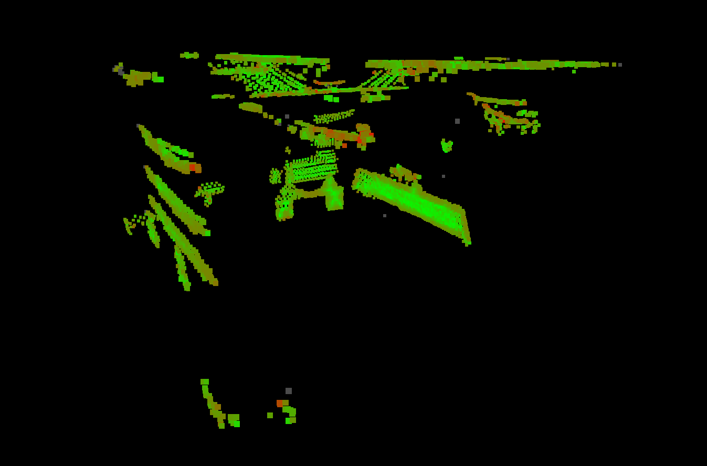
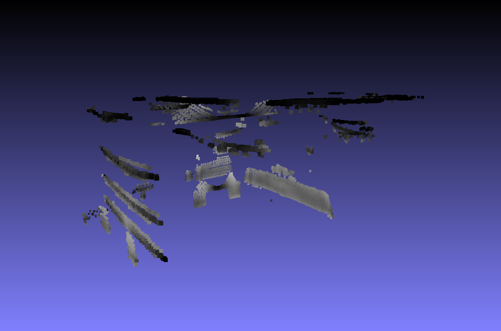
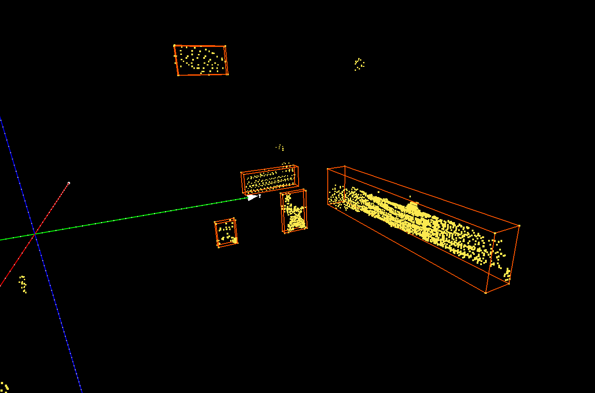
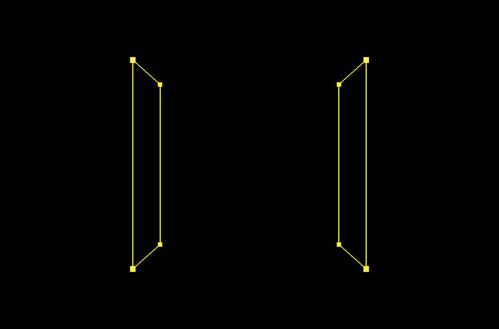

# 点云统计滤波方法及特征处理

## 目录结构

```txt
.
├── assets
│   └── images          // 文档图像
├── data
│   ├── dump            // 中间结果保存
│   ├── kinth           // 室内样例数据
│   └── output          // 滤波输出结果
├── pipeline3.ipynb
├── README.md
├── stagemerge.ipynb
├── test
│   ├── bboxdraw.ipynb   // 包围盒可视化测试
│   └── plyconvert.ipynb // ply 文件格式转换测试
└── utils
    ├── dump.py          // 文件格式转换工具
    ├── __init__.py
    ├── __pycache__
    └── tools.py         // 全局共享方法
```

## 预处理

- 半径滤波降噪
- 体素化降采样
- 格式转换

## 一阶段滤波

在这一阶段主要通过锚点及其邻域点所构成的集合进行 PCA 主轴比例分析，主轴的比例通过特征向量的特征值表示，代表在该轴向上点云投影的分散程度，因此若三个主轴分散程度大致相当，则可认为邻域点集合的几何特征大致是球形，否则就是平面型或者线型。通过将三个比例转换为对应的颜色分量以进行可视化或者过滤选择。

```python
eigvals, eigvecs = utils.pca_k(points[neighbour_idx_list], 3)
assert eigvals[0] >= eigvals[1] and eigvals[1] >= eigvals[2]
feat = np.array([
    (eigvals[0] - eigvals[1]) / (eigvals[0] + 1e-9),
    (eigvals[1] - eigvals[2]) / (eigvals[1] + 1e-9)
])
```



受到体素化降采样单位大小以及邻域搜索半径大小的影响，特征计算效果因半径而异，在上图中模拟桥梁部分点云的垂直线性特征被捕捉到呈现红色分量较多，其余位置如天花板和墙壁平面型特征强于线性特征，红色分量少。

在这一阶段主要是识别线性特征，但是无法确定线性的朝向，因此还需要额外的其他步骤继续过滤朝向不是向上的区域。

## 二阶段滤波

目前采用的方法是计算柱形邻域内的邻域点集合的 PCA 主轴与垂直向量 $(0,0,1)$ 的夹角，但是目前就效果而言不是很好，受到天花板和墙壁的影响，柱形邻域的主轴方向不能很好的体现邻域的垂直性，计划考虑使用其他的统计特征，比如邻域内点与锚点形成的向量术与垂直向量夹角的平均值。

```python
query = points[query_idx]
mask = (
    (np.abs(points[:, 0] - query[0]) < stage2_border / 2.0) &
    (np.abs(points[:, 1] - query[1]) < stage2_border / 2.0) &
    (np.abs(points[:, 2] - query[2]) < stage2_border)
)
mask[query_idx] = False
vicinity = points[mask]
if len(vicinity) < 3:
    stage2_feat_list.append(0.0)
    continue

feat = (1.0 - utils.sin_batch(points[mask] - query, np.array([0, 0, 1]))).mean()
```



图中红色与绿色分量较多，证明第一主轴和第二主轴都可能与垂直向量靠近，因为 PCA 主轴分析无法固定第一轴的向量，因此尽管三轴两两正交，但无法确定第一第二主轴的方向。

## ply 文件中的三维 AABB 包围盒显示

因为不方便安装 PCL 环境，也就没有办法做包围盒的渲染，所以还是需要本地实现一个包围盒算法和渲染方法比较好。我的想法是使用基于格雷码的顺序连线完成包围框的顶点连线，这样不会出现对角线连线的错误，并且这种方法是普适的，也适用于 OBB 类型的有向包围盒。这种本地渲染并将信息直接保存到文件中的好处是，后续如果需要在其他机器上查看结果不需要配置繁杂的开发环境，直接下一个可用的点云可视化软件就行了。



# 滤波流程示例

## 读取点云数据文件

```python
pcd_path = "data/kinth/pointcloud/1720509720.141261339.pcd"
pcd = o3d.io.read_point_cloud(pcd_path)
pcd = pcd.remove_radius_outlier(nb_points=25, radius=0.2)[0] # (pcd, new indexed from old)
points = np.asarray(pcd.points)
```

可调整的参数为半径滤波最小邻域点数量以及半径范围，需要根据雷达点云密度进行调整，一般在 $0.2~0.5$ 的范围。

## 两阶段点云滤波

滤波的具体流程实现主要包含在函数 `pipe2st` 中，可配置的参数包括两每个阶段滤波使用的半径大小以及最终过滤阈值，同时还包括了原始点云数据体素化的配置参数。

```python
def pipe2st(
    points: np.ndarray,
    voxel_size: float,
    stage1_radius: float,
    stage2_border: float,
    stage1_thresh: float=0.7,
    stage2_thresh: float=0.3
)
```

`stage_1` 第一阶段使用的滤波半径是球形半径，`stage_2` 第二阶段使用的是水平曼哈顿距离。两个阶段分别输出各自的掩码序列，最终两个掩码执行布尔与操作，筛选出最终垂直特征明显的平面。

### 第一阶段

```python
# do the stage 1
stage1_feat_list = []
search_tree = o3d.geometry.KDTreeFlann(utils.npy2o3d(points))
for query_idx in tqdm(range(len(points)), total=len(points), ncols=100):
    query = points[query_idx]
    neighbour_num, neighbour_idx_list, _ = search_tree.search_radius_vector_3d(query, stage1_radius)
    if neighbour_num <= 3:
        stage1_feat_list.append([0.0, 0.0])
        continue
    eigvals, eigvecs = utils.pca_k(points[neighbour_idx_list], 3)
    assert eigvals[0] >= eigvals[1] and eigvals[1] >= eigvals[2]
    feat = np.array([
        (eigvals[0] - eigvals[1]) / (eigvals[0] + 1e-9),
        (eigvals[1] - eigvals[2]) / (eigvals[1] + 1e-9)
    ])
    feat = feat / feat.sum()
    stage1_feat_list.append(feat)
stage1_feat_list = np.array(stage1_feat_list)
```

1. 对每个点使用 kd-tree 进行快速近邻近似搜索得到半径内的邻域点
2. 对邻域点集合计算坐标 PCA 协方差矩阵的特征值以获得三个主轴比例表示的几何特征
3. 根据主轴比保存特征序列，每个点的特征是一个二元组，包含了 `第一主轴/第二主轴` 以及 `第二主轴/第三主轴` 的比例


### 第二阶段

```python
# do the stage 2
stage2_feat_list = []
for query_idx in tqdm(range(len(points)), total=len(points), ncols=100):
    query = points[query_idx]
    mask = (
        (np.abs(points[:, 0] - query[0]) < stage2_border / 2.0) &
        (np.abs(points[:, 1] - query[1]) < stage2_border / 2.0) &
        (np.abs(points[:, 2] - query[2]) < stage2_border)
    )
    mask[query_idx] = False
    vicinity = points[mask]
    if len(vicinity) < 3:
        stage2_feat_list.append(0.0)
        continue
    
    feat = (1.0 - utils.sin_batch(points[mask] - query, np.array([0, 0, 1]))).mean()
    stage2_feat_list.append(feat)
stage2_feat_list = np.array(stage2_feat_list)
```

1. 对每个点计算水平曼哈顿距离的邻域点几何，垂直距离上可以调整范围
2. 每个邻域点几何计算与世界垂直向量的正弦相似度向量束的平均值，表征该邻域点集合的垂直特征是否明显，0.0 为无明显垂直线性特征，1.0 为完全垂直线性特征
3. 保存每个点的邻域垂直特征到特征序列

### 联合过滤

```python
# do the filtration
mask1 = (stage1_feat_list[:, 1] > stage1_thresh)
mask2 = (stage2_feat_list > stage2_thresh)
mask_filtered = mask1 & mask2
points_filtered = points[mask_filtered]
mask_denoised = utils.radius_filter(points_filtered, 0.2, 20)
points_denoised = points_filtered[mask_denoised] 
```

根据函数参数确定的第一阶段特征强度阈值和第二阶段特征强度阈值筛选出同时符合两个阶段滤波的点云。

# 包围框显示

这部分的核心主要是确定包围框的 8 个顶点的连线顺序，因为服务器不方便作 PCL 的可视化，所以想要把包围框的信息一并保存到输出结果文件中需要自定义 ply 文件中线段的显示顺序。

## 使用2位格雷码确定连线顺序

对于 OBB 包围框来说，先不要旋转，生成它的 AABB 形式，那么就转换为了如何设计 AABB 类型包围框顶点的连接顺序。立方体框架一共有 12 条边需要连接，我的想法是先确定沿 $X$ 轴的前后两面各八条边的连接顺序，然后中间四条边就好办了。对于去均值使得包围框中心点在坐标系原点的包围框来说，每个轴上的两个值都被分为对应的正负符号，所以总共是 8 种组合 $(+/-,+/-,+/-)$ 。 首先固定 $X$ 轴的符号，然后其他两个轴使用卡诺图。


使用格雷码的概念，这样子画的顺序可以保证四边形的四条边是顺序连接的：

```python
# draw_sequence = [
#     [[0, 0, 0], [0, 0, 1]],
#     [[0, 0, 1], [0, 1, 1]],
#     [[0, 1, 1], [0, 1, 0]],
#     [[0, 1, 0], [0, 0, 0]],
#     [[1, 0, 0], [1, 0, 1]],
#     [[1, 0, 1], [1, 1, 1]],
#     [[1, 1, 1], [1, 1, 0]],
#     [[1, 1, 0], [1, 0, 0]]
# ]

draw_sequence = [
	[0, 1],
	[1, 3],
	[3, 2],
	[2, 0],
	[4, 5],
	[5, 7],
	[7, 6],
	[6, 4]
]
```



___

对滤波后的点云使用基于密度的聚类算法 dbscan 之后，可以对每个聚类点云使用该方法生成包围框：

```python
def aabb_draw_meta(data):
    assert isinstance(data, np.ndarray) or isinstance(data, o3d.geometry.PointCloud)

    o3dpcd = None
    if isinstance(data, np.ndarray):
        assert len(data.shape) == 2
        pcd = o3d.geometry.PointCloud()
        pcd.points = o3d.utility.Vector3dVector(data)
        o3dpcd = pcd
    else:
        o3dpcd = data
    
    aabb = o3dpcd.get_axis_aligned_bounding_box()
    # print(aabb.get_min_bound(), aabb.get_max_bound())
    bbox_vtx_list = np.asarray(aabb.get_box_points())

    center = bbox_vtx_list.mean(axis=0)

    bbox_vtx_list = bbox_vtx_list - center

    draw_sequence = [
        [0, 1],
        [1, 3],
        [3, 2],
        [2, 0],
        [4, 5],
        [5, 7],
        [7, 6],
        [6, 4],

        [0, 4],
        [1, 5],
        [3, 7],
        [2, 6]
    ]

    selection_base = np.hstack([np.abs(bbox_vtx_list[0]).reshape(-1, 1), -np.abs(bbox_vtx_list[0]).reshape(-1, 1)])

    bbox_points = []
    for i in range(8):
        idx = [int(x) for x in bin(i)[2:].zfill(3)]
        bbox_points.append([
            selection_base[0][idx[0]],
            selection_base[1][idx[1]],
            selection_base[2][idx[2]]
        ])
    
    return np.array(bbox_points + center), np.array(draw_sequence)
```

