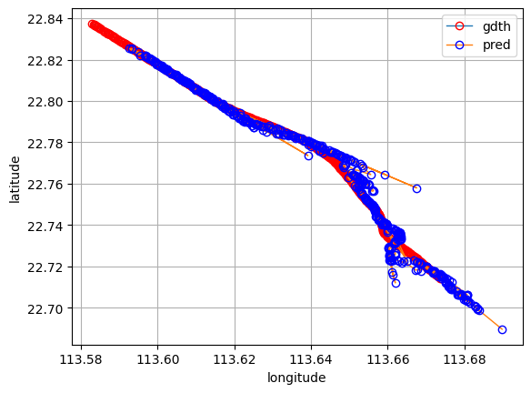
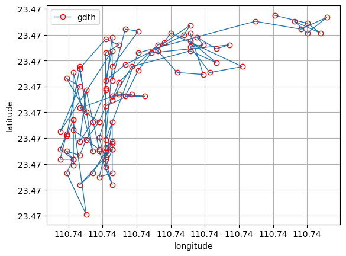
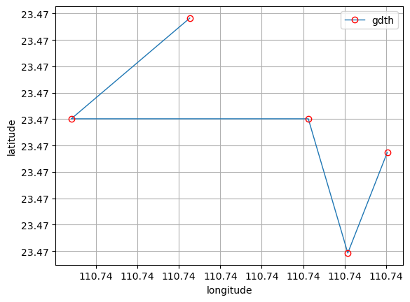

# 目录结构

* data - 存放 Excel 样例数据分割结果
* utils - kd-tree 实现文件
* segment.ipynb - 数据预处理及分割
* ekf.ipynb - 二次曲线拟合及基于时间步的预测

# 文件数据预处理

使用 `pandas` 库加载 Excel 样例数据，根据时间戳提取日期部分作为分组依据，保存分组结果：

```python
dates = [str(x)[:10] for x in df["timestamp"].values]
df["date"] = dates
unixstamp = [
    datetime.strptime(np.datetime_as_string(timestamp, unit='ms'), '%Y-%m-%dT%H:%M:%S.%f').timestamp()
    for timestamp in df["timestamp"].values
]
# for timestamp in df["timestamp"].values:
#     try:
#         unixstamp.append(datetime.strptime(np.datetime_as_string(timestamp, unit='ms'), '%Y-%m-%dT%H:%M:%S.%f'))
#     except Exception as e:
#         print("error data", str(timestamp), e)
# unixstamp = [ for timestamp in df["timestamp"].values]
df["unixstamp"] = unixstamp

groups = df.groupby("date")
for name, group in groups:
    file_path = f"data/{name}.csv"
    group.to_csv(file_path, index=False)
    print(f"saved group {name}")
```

# 基于二次曲线拟合的轨迹预测

对 CSV 分段数据文件使用时间戳排序航行途径点：

```python
from collections import defaultdict

ship_gis = defaultdict(list)
for mmsi in df["mmsi"].unique():
    filtered_df = df[df["mmsi"] == mmsi]
    mmsi = str(mmsi)
    for idx, row in filtered_df.iterrows():
        ship_gis[mmsi].append(tuple(row[col] for col in ["longitude", "latitude", "unixstamp"]))
    ship_gis[mmsi] = np.array(ship_gis[mmsi])
    ship_gis[mmsi] = ship_gis[mmsi][np.argsort(ship_gis[mmsi][:, 2])] # sort according to the timestamp
```

然后使用 `scikit-learn` 库中包含的 `curve_fit` 曲线拟合进行二次曲线参数估计：

```python
data = ship_gis["413837924"][:500, :2]
pred = []
win_len = 4
def quadratic(x, a, b, c):
    return a * x**2 + b * x + c

for i in range(len(data) - win_len):
    x_window = data[i:i + win_len, 0]
    y_window = data[i:i + win_len, 1]

    params, _ = curve_fit(quadratic, x_window, y_window)
    a, b, c = params

    x_right = x_window[-1]
    y_right = y_window[-1]

    quadratic(x_right, a, b, c)

    derivative = 2 * a * x_right + b

    step_size = np.mean(np.diff(x_window)) * 2.5

    x_next = x_right + step_size
    y_next = quadratic(x_next, a, b, c)

    pred.append((x_next, y_next))
```

这里选择了其中一条船的前 500 个数据点，预测所使用的历史窗口长度为 4 个数据点，预测时间步为 2.5 个单位时间之后船舶的预测位置。总体效果而言还是比较准确的，如果预测时间步为更长的间隔，比如 50 个时间步，可能会出现一些噪声，这是预期的行为，因为预测总是根据历史窗口内的行为去预测，但是船舶的实际轨迹是无法预测的，是由人操控的，历史窗口预测其实是基于了船舶航行中惯性大无法快速改变行动轨迹的基础来预测的。



# kd-tree 搜索航线近邻点

对于航线 GPS 轨迹存在漂移问题的船舶，需要使用 kd-tree 对轨迹点近邻搜索完成数据平滑，kd-tree 可以只使用空间维度，或者添加 Unix 时间戳为时间维度在时空上搜索最近的近邻点。



对开头的点搜索时空上最近的 5 个近邻点结果如图所示，可以利用 5 个近邻点的平均值作为当前时间步数据平滑的结果。

